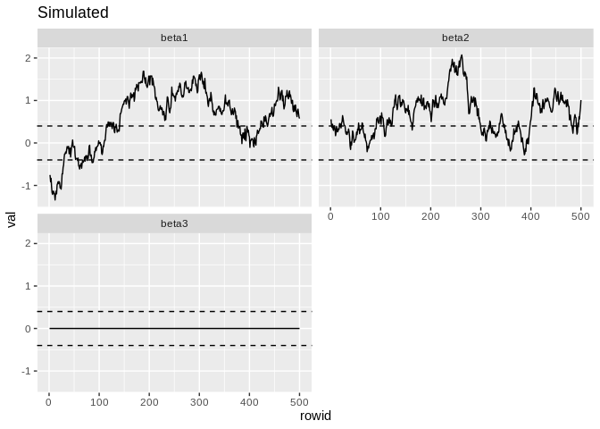
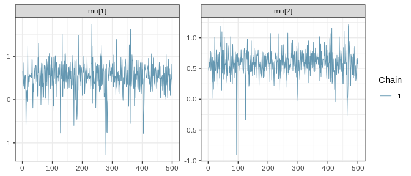

<!-- README.md is generated from README.Rmd. Please edit that file -->

# ltm

The goal of ltm is to fit Bayesian Latent Threshold Models using R. The
model in the AR(1) form is defined by these equations:

\[
\begin{aligned}
y_{it} &= \sum_{j=1}^J x_{ijt} b_{ijt} + \varepsilon_{it} \\
b_{ijt} &= \beta_{ijt} \,\mathbb I(|\beta_{ijt}| \geq d_{ij}) \\
\beta_{ij,t+1} &= \mu_{ij} + \phi_{ij}(\beta_{ijt}-\mu_{ij}) + \eta_{ijt}
\end{aligned}
\]

for \(i \in 1,\dots, I\), \(j \in 1,\dots, J\) and \(t \in 1,\dots, T\).
These models can be fit separatedly for each \(i\). The example below
fits the model to one single series (\(I=1\)).

## Load packages

``` r
library(tidyverse)
#> ── Attaching packages ─────────────────────────────────── tidyverse 1.2.1 ──
#> ✔ ggplot2 3.1.0          ✔ purrr   0.3.2     
#> ✔ tibble  2.1.1          ✔ dplyr   0.8.0.1   
#> ✔ tidyr   0.8.3.9000     ✔ stringr 1.4.0     
#> ✔ readr   1.3.1          ✔ forcats 0.3.0
#> ── Conflicts ────────────────────────────────────── tidyverse_conflicts() ──
#> ✖ dplyr::filter() masks stats::filter()
#> ✖ dplyr::lag()    masks stats::lag()
devtools::load_all()
#> Loading ltm
```

## Simulated Example

``` r
set.seed(103)

d_sim <- ltm_sim(
  ns = 500, nk = 2, 
  vmu = matrix(c(.5,.5), nrow = 2), 
  mPhi = diag(2) * c(.99, .99),
  mSigs = c(.1,.1),
  dsig = .15,
  vd = matrix(c(.4,.4), nrow = 2)
)

# adding zeroed beta
d_sim$mx <- cbind(d_sim$mx, runif(500)-.5)
d_sim$mb <- cbind(d_sim$mb, 0)

p_sim <- d_sim$mb %>%
  as.data.frame() %>% 
  as_tibble() %>%
  set_names(paste0("beta", 1:(ncol(.)))) %>%
  rowid_to_column() %>%
  gather(beta, val, -rowid) %>%
  ggplot(aes(x = rowid, y = val)) +
  geom_line() +
  facet_wrap(~beta, ncol = 2) +
  geom_hline(yintercept = c(-1,1) * .4, linetype = 2) +
  ggtitle("Simulated")

p_sim
```



``` r
result <- ltm_mcmc(d_sim$mx, d_sim$vy, burnin = 2000, iter = 8000, K = 3)
# readr::write_rds(result, "data-raw/result.rds", compress = "xz")
```

## Results

Results after 2000 burnin and 8000 iterations.

``` r
result <- read_rds("data-raw/result.rds")
```

### Summary statistics

(like Table 1 in the paper)

``` r
summary_fun <- function(.x) {
  v1 <- map_dbl(.x, first)
  q <- quantile(v1, c(.05, .95))
  tibble(mean = mean(v1), sd = sd(v1), q05 = q[1], q95 = q[2])
}

summary_table <- map_dfr(result[-1], summary_fun, .id = "parm") %>% 
  mutate(true = c(.5, .99, .4, .15, .1)) %>% 
  select(parm, true, everything()) %>% 
  mutate_if(is.numeric, round, 4)

knitr::kable(summary_table)
```

| parm     | true |   mean |     sd |      q05 |    q95 |
| :------- | ---: | -----: | -----: | -------: | -----: |
| mu       | 0.50 | 0.4617 | 0.3846 | \-0.2004 | 0.9944 |
| phi      | 0.99 | 0.9865 | 0.0075 |   0.9726 | 0.9967 |
| d        | 0.40 | 0.5820 | 0.3671 |   0.0475 | 1.1406 |
| sig      | 0.15 | 0.1820 | 0.0135 |   0.1615 | 0.2059 |
| sig\_eta | 0.10 | 0.0961 | 0.0164 |   0.0718 | 0.1253 |

### MCMC Chains

``` r
map_dfc(result[-1], ~map_dbl(.x, first)) %>% 
  rowid_to_column() %>% 
  gather(parm, val, -rowid) %>% 
  ggplot(aes(x = rowid, y = val)) +
  geom_line(alpha = .9) +
  geom_hline(aes(yintercept = mean), data = summary_table, colour = "red") +
  facet_wrap(~parm, scales = "free_y") +
  labs(x = "Iteration", y = "Value")
```



### Estimated Betas

``` r
mediana <- apply(simplify2array(result$beta), c(1,2), median, simplify = FALSE)
qt1 <- apply(simplify2array(result$beta), c(1,2), quantile, .05, simplify = FALSE)
qt2 <- apply(simplify2array(result$beta), c(1,2), quantile, .95, simplify = FALSE)
beta_stats <- imap_dfr(list(mediana = mediana, qt1 = qt1, qt2 = qt2), ~{
  .x %>%
    as.data.frame() %>%
    as_tibble() %>%
    rowid_to_column() %>%
    gather(beta, valor, -rowid) %>%
    mutate(tipo = .y)
})

p2 <- beta_stats %>%
  spread(tipo, valor) %>%
  ggplot(aes(x = rowid, y = mediana)) +
  geom_line() +
  facet_wrap(~beta, ncol = 2) +
  geom_ribbon(aes(ymin = qt1, ymax = qt2), alpha = .2) +
  ggtitle("Estimated")

p2
```


## TODO

  - \[ \] Write pure R script (today)
  - \[ \] Write for \(b_t\) with \(y_{it}\) ()
  - \[ \] Test on real data
  - \[ \] Hyperparameter control
  - \[ \] Better output to use bayesplot
  - \[ \] Better Documentation
