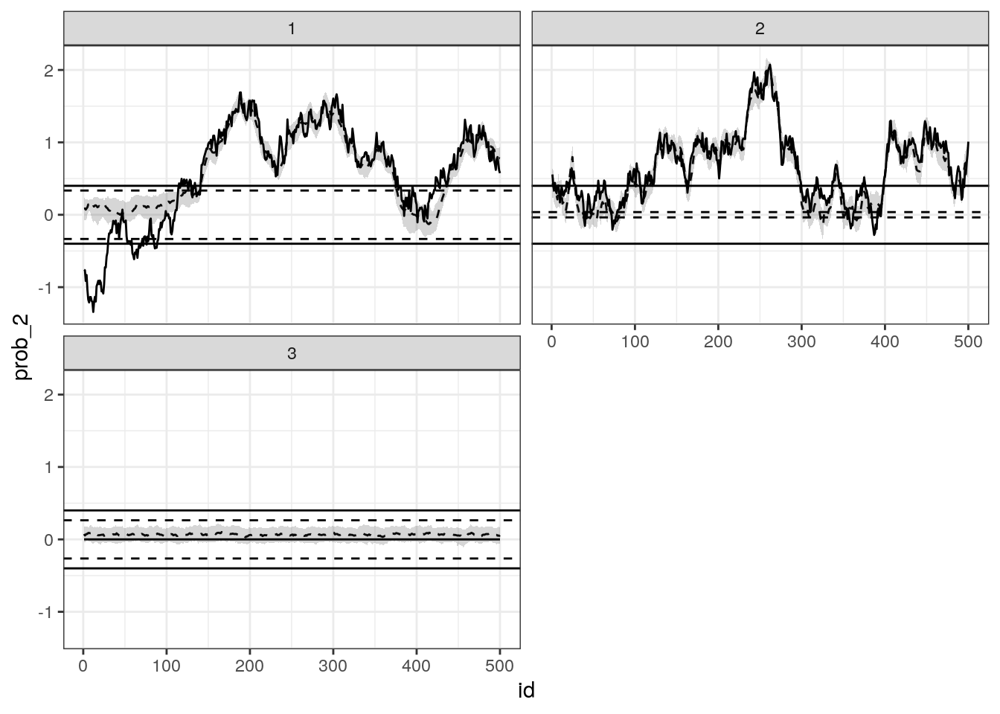

<!-- badges: start -->

[](https://travis-ci.org/curso-r/bltm)
[](https://ci.appveyor.com/project/curso-r/bltm)
[](https://cran.r-project.org/package=bltm)
<!-- badges: end -->

<!-- README.md is generated from README.Rmd. Please edit that file -->

# bltm

The goal of bltm is to fit Bayesian Latent Threshold Models using R. The
model in the AR(1) form is defined by these equations:

\[\begin{aligned}
y_{it} &= \sum_{j=1}^J x_{ijt} b_{ijt} + \varepsilon_{it} \\
b_{ijt} &= \beta_{ijt} \,\mathbb I(|\beta_{ijt}| \geq d_{ij}) \\
\beta_{ij,t+1} &= \mu_{ij} + \phi_{ij}(\beta_{ijt}-\mu_{ij}) + \eta_{ijt}
\end{aligned}\]

for \(i \in 1,\dots, I\), \(j \in 1,\dots, J\) and \(t \in 1,\dots, T\).
These models can be fit separatedly for each \(i\). The example below
fits the model to one single series (\(I=1\)).

## Load packages

``` r
library(tidyverse)
#> ── Attaching packages ───────────────────────────────────────────────────────────────────── tidyverse 1.2.1 ──
#> ✔ ggplot2 3.2.0          ✔ purrr   0.3.2     
#> ✔ tibble  2.1.3          ✔ dplyr   0.8.1     
#> ✔ tidyr   0.8.3.9000     ✔ stringr 1.4.0     
#> ✔ readr   1.3.1          ✔ forcats 0.4.0
#> ── Conflicts ──────────────────────────────────────────────────────────────────────── tidyverse_conflicts() ──
#> ✖ dplyr::filter() masks stats::filter()
#> ✖ dplyr::lag()    masks stats::lag()
devtools::load_all()
#> Loading bltm
```

## Simulated Example

``` r
set.seed(103)

d_sim <- ltm_sim(
  ni = 5, ns = 500, nk = 2, 
  alpha = 0,
  vmu = matrix(c(.5,.5), nrow = 2), 
  mPhi = diag(2) * c(.99, .99),
  mSigs = c(.1,.1),
  dsig = .15,
  vd = matrix(c(.4,.4), nrow = 2)
)

# adding zeroed beta
binder <- array(runif(500)-.5, c(5, 500, 1))
d_sim$mx <- abind::abind(d_sim$mx, binder, along = 3)
d_sim$mb <- cbind(d_sim$mb, 0)
```

``` r
result <- ltm_mcmc(d_sim$mx, d_sim$vy, burnin = 100, iter = 500)
# readr::write_rds(result, "data-raw/result.rds", compress = "xz")
```

    Iteration:     1 /   600 [  0%]  (Warmup)
    Iteration:    60 /   600 [ 10%]  (Warmup)
    Iteration:   120 /   600 [ 20%]  (Sampling)
    Iteration:   180 /   600 [ 30%]  (Sampling)
    Iteration:   240 /   600 [ 40%]  (Sampling)
    Iteration:   300 /   600 [ 50%]  (Sampling)
    Iteration:   360 /   600 [ 60%]  (Sampling)
    Iteration:   420 /   600 [ 70%]  (Sampling)
    Iteration:   480 /   600 [ 80%]  (Sampling)
    Iteration:   540 /   600 [ 90%]  (Sampling)
    Iteration:   600 /   600 [ 100%]  (Sampling)

## Results

Results after 100 burnin and 500 iterations.

``` r
result <- read_rds("data-raw/result.rds")
```

### Summary statistics

``` r
vars_to_analyse <- !str_detect(colnames(result), "beta\\[")
summary_table <- result[,vars_to_analyse] %>%
  as.data.frame() %>%
  tibble::rowid_to_column() %>%
  tidyr::gather(key, val, -rowid) %>%
  dplyr::group_by(key) %>%
  dplyr::summarise(
    median = median(val),
    sd = sd(val),
    q025 = quantile(val, 0.025),
    q975 = quantile(val, 0.975)
  )

knitr::kable(summary_table)
```

| key           |      median |        sd |        q025 |      q975 |
| :------------ | ----------: | --------: | ----------: | --------: |
| alpha\[1\]    |   0.0076648 | 0.1781915 | \-0.3405058 | 0.3593770 |
| alpha\[2\]    | \-0.0054158 | 0.1830903 | \-0.3785451 | 0.3289486 |
| alpha\[3\]    | \-0.0047880 | 0.1834158 | \-0.3854517 | 0.3297607 |
| alpha\[4\]    | \-0.0163057 | 0.1746813 | \-0.3578320 | 0.2923298 |
| alpha\[5\]    | \-0.0016525 | 0.1801260 | \-0.3304960 | 0.3382569 |
| d\[1\]        |   0.3293945 | 0.0496160 |   0.2324488 | 0.4076028 |
| d\[2\]        |   0.0150496 | 0.0559342 |   0.0150496 | 0.1553439 |
| d\[3\]        |   0.2701171 | 0.0146839 |   0.2296899 | 0.2701171 |
| mu\[1\]       |   0.5296798 | 0.3416395 | \-0.2345459 | 1.0597430 |
| mu\[2\]       |   0.5947912 | 0.2164022 |   0.1596099 | 1.0128513 |
| mu\[3\]       |   0.0665906 | 0.0173249 |   0.0260728 | 0.0945483 |
| phi\[1\]      |   0.9904074 | 0.0050235 |   0.9784768 | 0.9977583 |
| phi\[2\]      |   0.9713490 | 0.0113390 |   0.9458727 | 0.9921012 |
| phi\[3\]      |   0.6437641 | 0.1325909 |   0.3581005 | 0.8528770 |
| sig\_eta\[1\] |   0.0731782 | 0.0083558 |   0.0561148 | 0.0888805 |
| sig\_eta\[2\] |   0.1222165 | 0.0138444 |   0.0921127 | 0.1494326 |
| sig\_eta\[3\] |   0.0623744 | 0.0100680 |   0.0486990 | 0.0867437 |
| sig\[1\]      |   0.1760752 | 0.0045631 |   0.1677408 | 0.1878592 |

### MCMC Chains

``` r
bayesplot::mcmc_trace(result, regex_pars = "mu\\[[12]") +
  theme_bw()
```


### Estimated Betas

``` r
# check this function inside demo/ folder
source("demo/plot_betas.R")
plot_betas(result, 1:3, real_values = d_sim) +
  facet_wrap(~factor(p), ncol = 2) +
  theme_bw()
```



## Model details

### Sampling from \(\alpha_i^{*}\)

\[\bar y_i = \frac 1 T \sum_{t=1} y_{it}\]

\[\mu^{*}_{\alpha} = \frac{a^*T + \mu_{\alpha}^0 s_{\alpha}^0}{T + s_{\alpha}^0},\]

where

\[a^*_i=\frac{1}{K}\sum_{t=1}^{T}\sum_{k=1}^{K}x_{itk}\beta_{tk}\]

Generate using

\[\boldsymbol\alpha^{*} \sim\mathcal N(\mu_{\alpha}^{*}, \sigma^{*2}),\]

where \(\sigma^{*2}\) is the posterior sample of \(\sigma\)

### Sampling from \(\boldsymbol\beta\)

The difference between the paper and the code is that it checks if some
of the \(\boldsymbol\beta\) should be replaced by zero. Actually, it is
not a difference; the appendix is just a little obscure in this passage.

First, we calculate \(M_t\) and \(m_t\) (depending on \(t\)), then we
generate candidates for \(\beta_t\) and their log-densities using the
normal distribution.

We then recalculate \(M_t\) and \(m_t\), replacing some of \(x_t\)s
entries by zero, depending on a condition based on the threshold and the
values of \(\boldsymbol\beta\). Finally, we obtain the log-density of
the previously calculated \(m_t\) using these new parameters. This is
the MH step where we draw a candidate from a (auxiliary) posterior
distribution of non-threshold model. When we decide to accept the
candidate, we compute the posterior distribution of the auxiliary
posterior distribution and the true posterior distribution (of the
threshold model). For the latter, we need to replace some of \(x_t\)’s
entries by zero depending on a condition based on the threshold and the
betas.

It’s important to note that if there aren’t any \(\beta\) to replace by
zero, then we should accept the new \(\boldsymbol\beta\) with
probability one, because the posterior has an analytic formula.

## LICENSE

MIT
